# Laboratorio 16 - Cinespoilers

Este documento reúne un resumen general del proyecto Cinespoilers desarrollado dentro de Lab16, junto con evidencia visual del proceso de desarrollo.

## Resumen del proyecto

Cinespoilers es una web de películas desarrollada con React, TypeScript y Vite. Su objetivo es ofrecer una experiencia sencilla y atractiva para explorar el catálogo de cine, consultar información de películas y descubrir contenido por género.

La aplicación consume la API de TMDB para obtener datos actualizados sobre películas, incluyendo:

- películas populares
- estrenos y funciones actuales
- próximos lanzamientos
- películas mejor valoradas
- búsqueda de títulos
- detalles de cada película y sus géneros

## Funcionalidades principales

- Navegación por secciones de películas: populares, en cines, próximamente y mejor valoradas.
- Búsqueda de películas por nombre.
- Visualización de detalles de cada película.
- Exploración por géneros.
- Diseño moderno y experiencia de usuario enfocada en la consulta rápida de contenido.

## Evidencia de desarrollo

A continuación se muestran capturas del laboratorio como evidencia visual del avance del proyecto:
Alex Dionisio
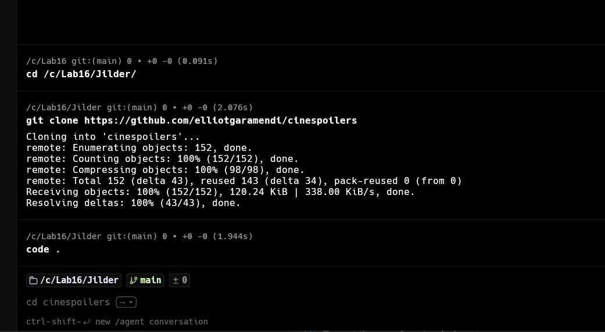

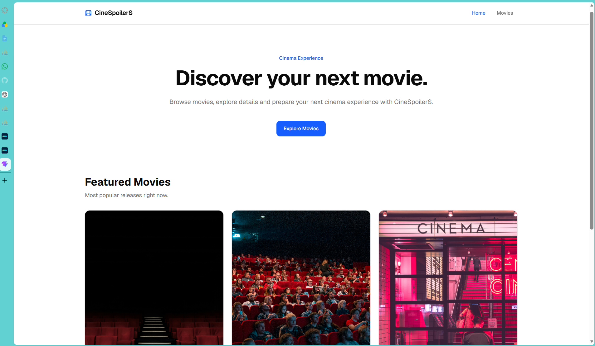

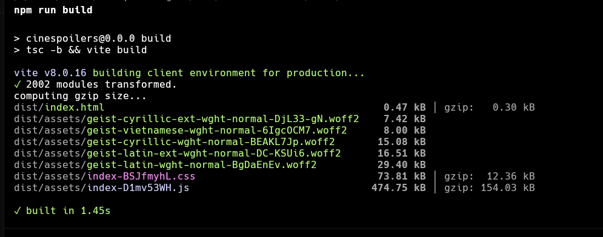

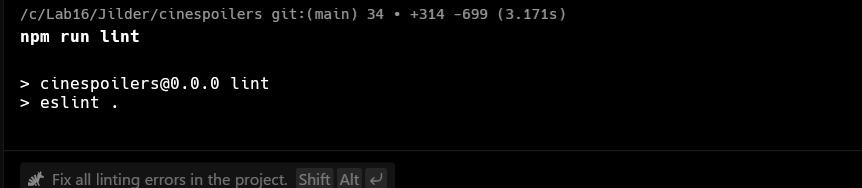

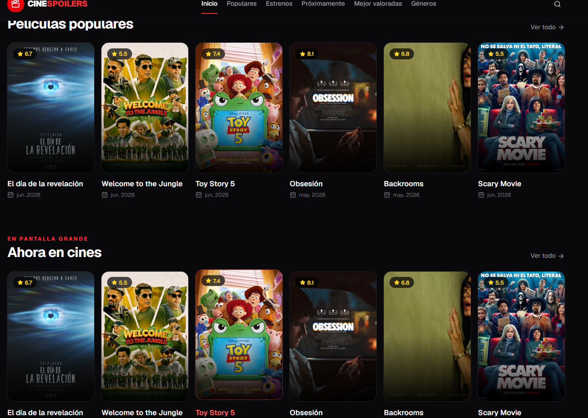

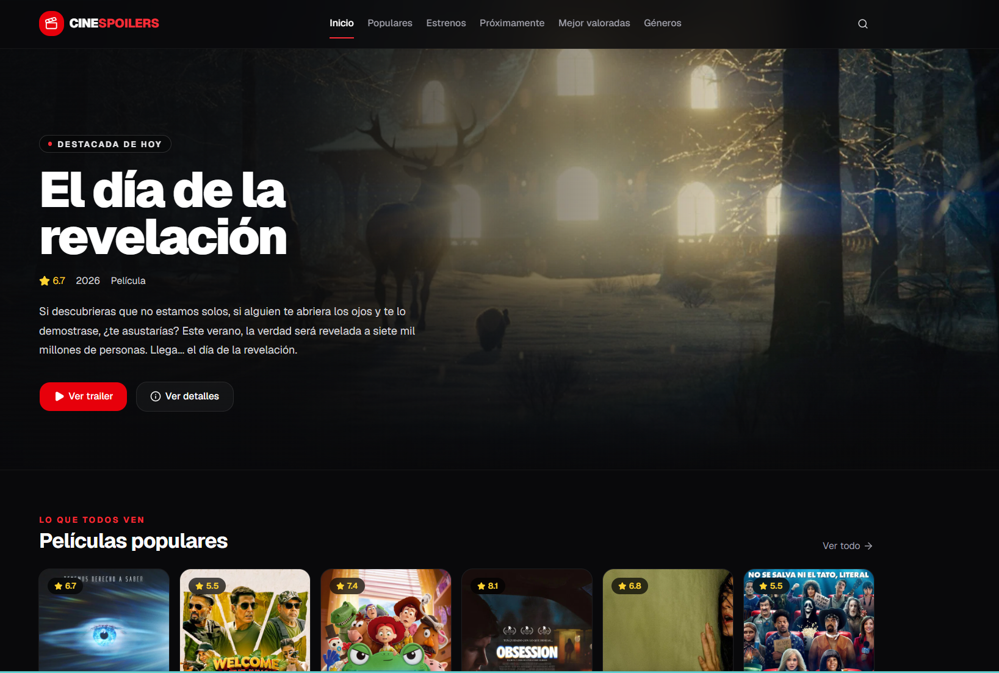
Naomi Veliz
##  Evidencias
-Clonando repositorio
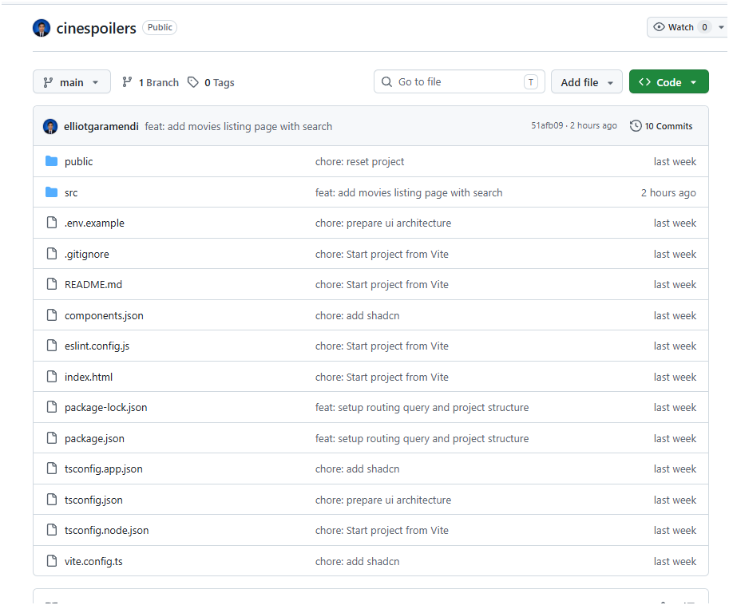

-Sin Api
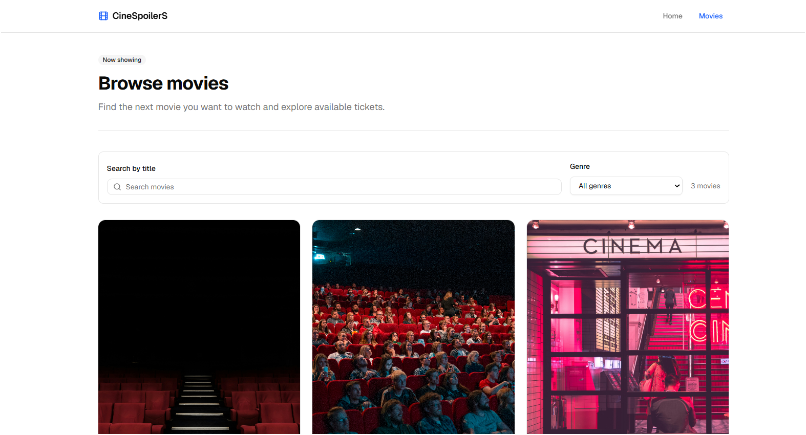

-Con Api
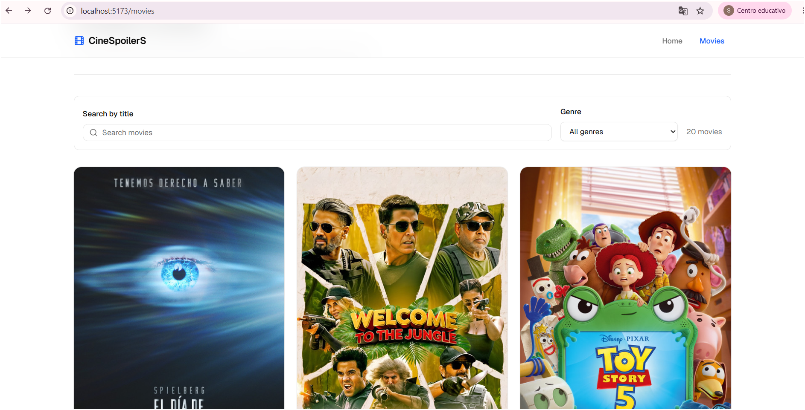

- Captura de la home
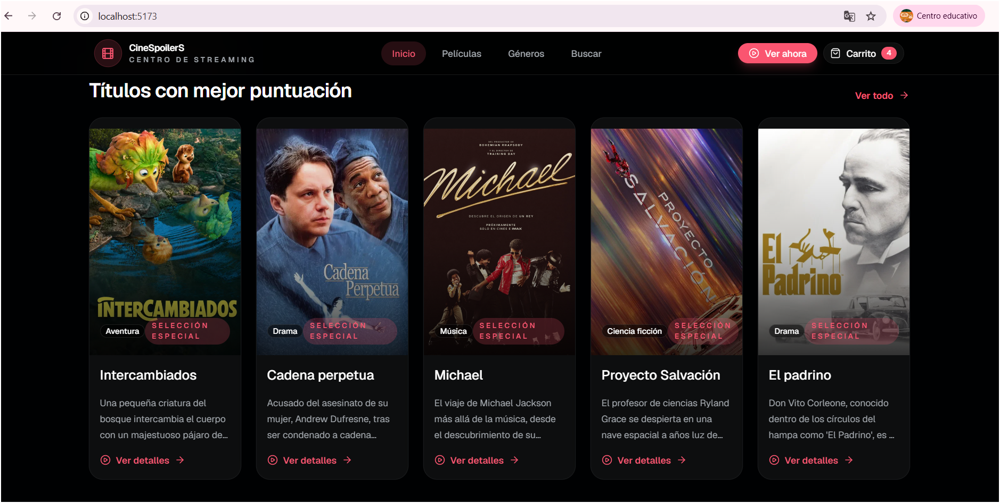

- Captura del catálogo
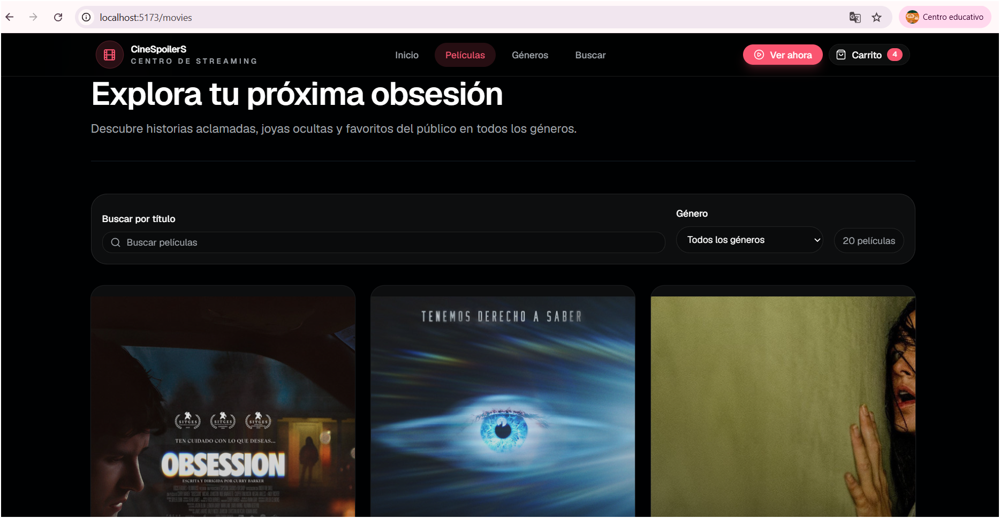

- Captura del detalle de película
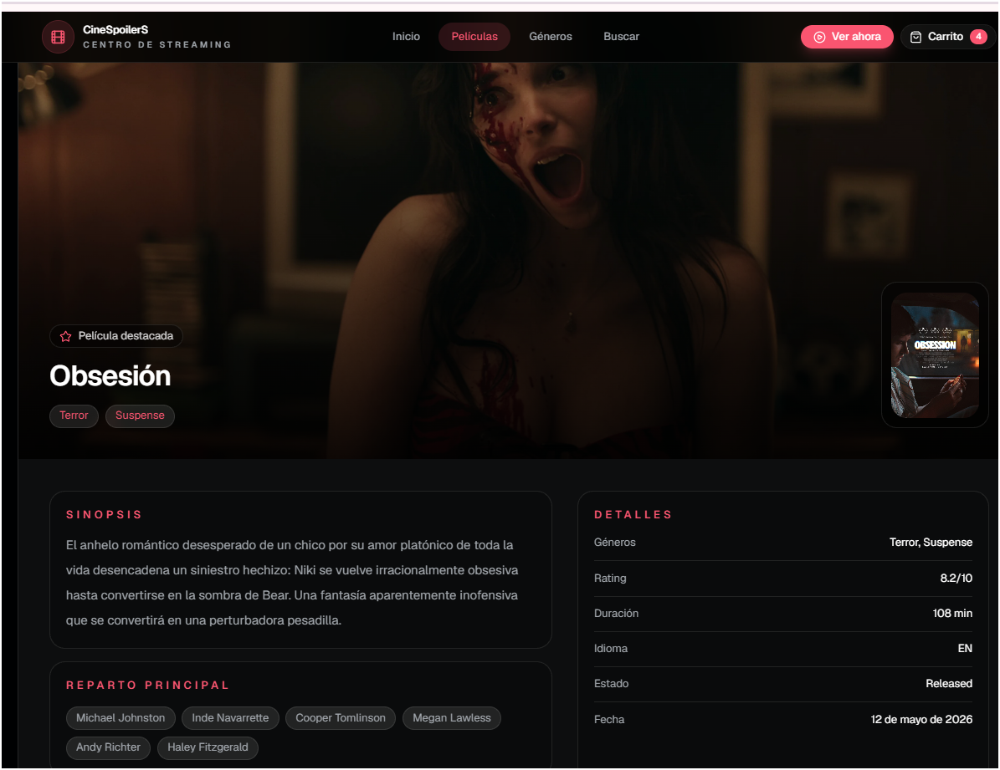
- Captura del carrito y checkout
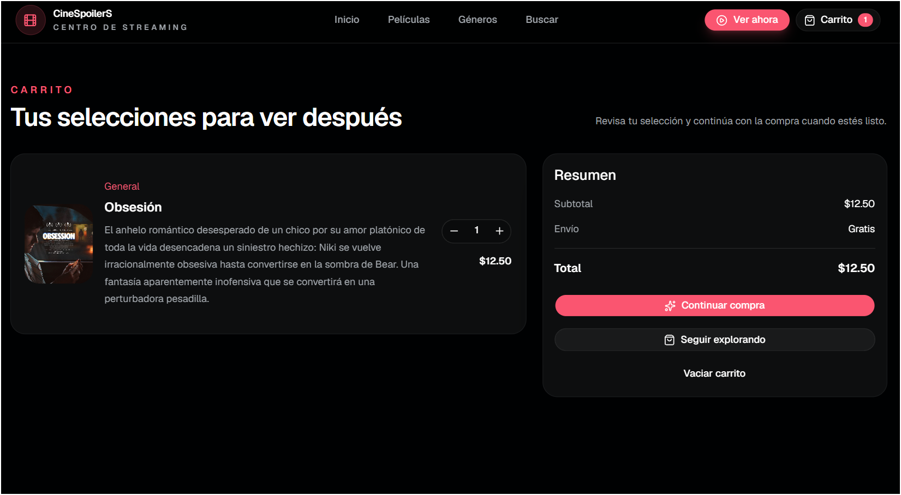
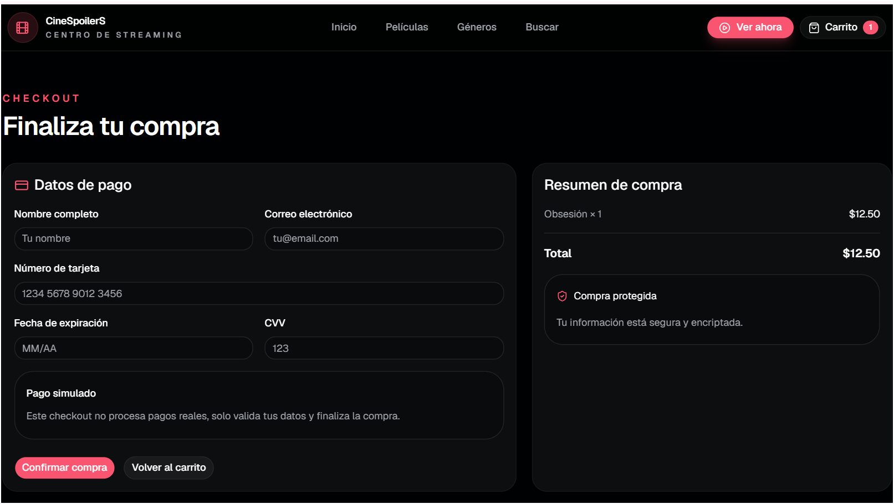

## Tecnologías utilizadas

- React
- TypeScript
- Vite
- React Router
- API TMDB

Este README sirve como una referencia general del laboratorio y del proyecto Cinespoilers, manteniéndose fuera de las carpetas de Adriana, Jilder y Naomi, pero dentro de Lab16.
